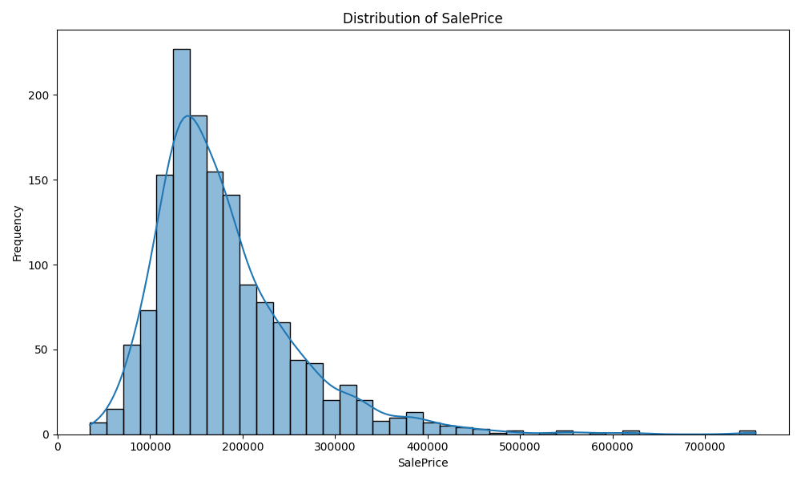
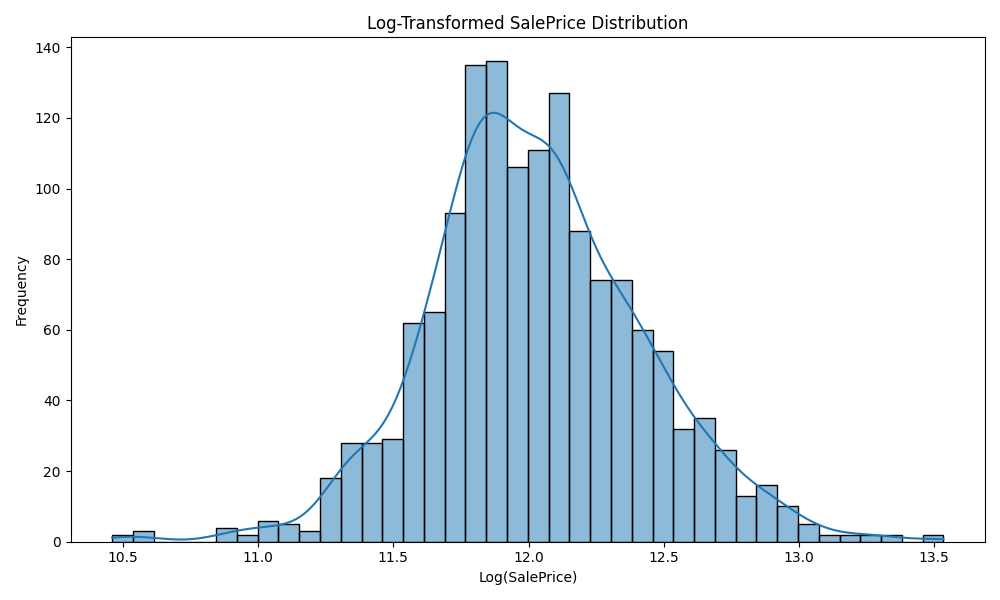
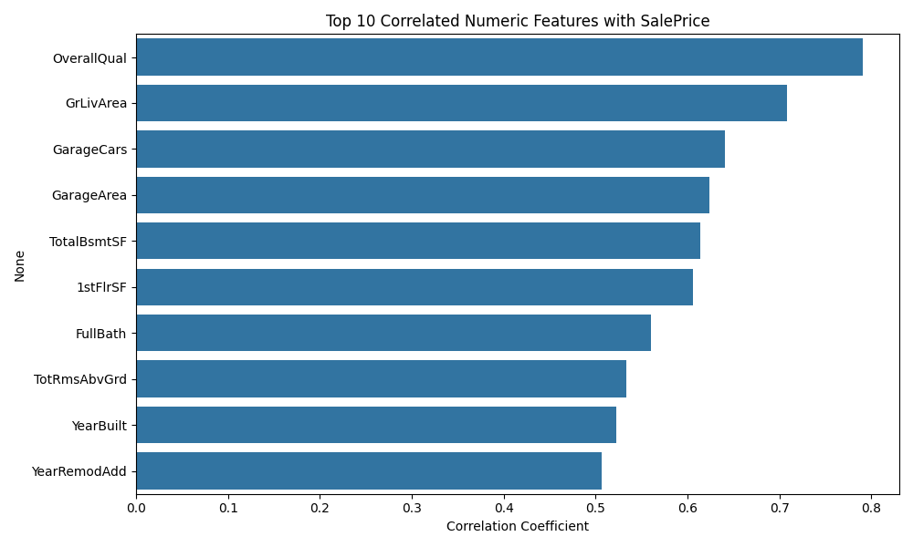
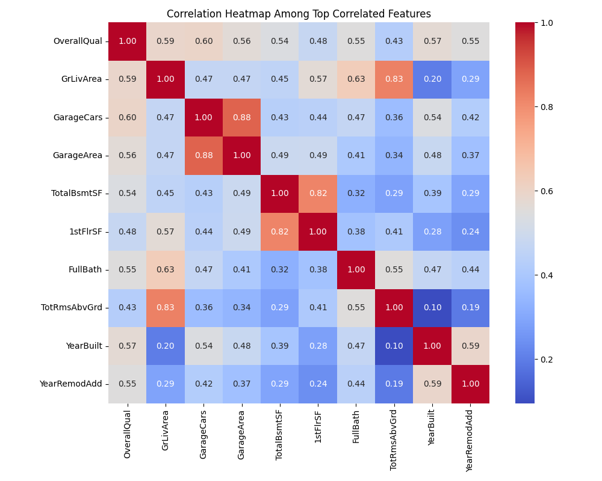
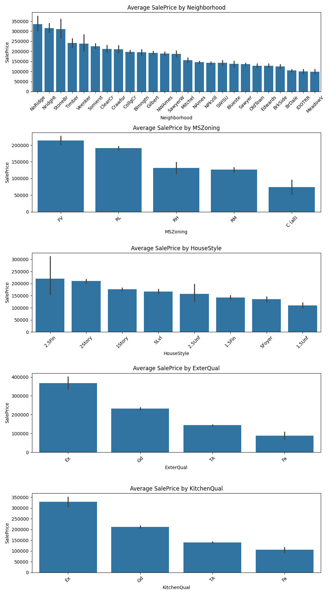
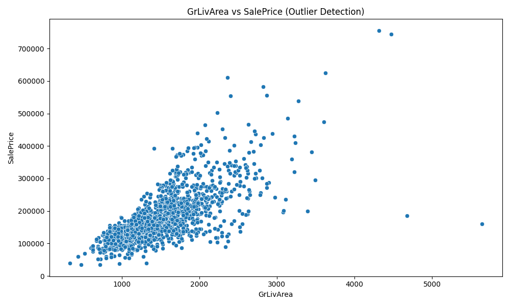
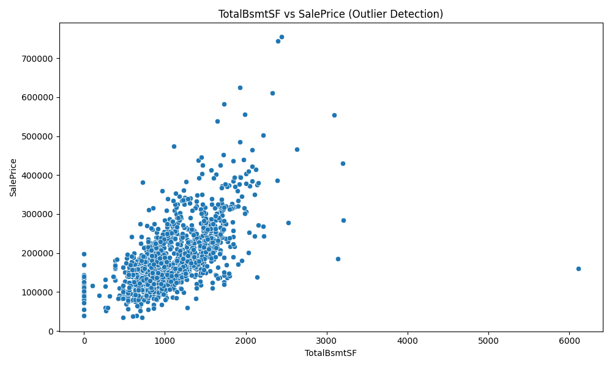

# 📊 EDA Summary

## ✅ 기본 정보
- 총 샘플 수: 1460개
- 총 컬럼 수: 81개
- 타겟 변수: `SalePrice` (연속형)
- 식별자 컬럼: `Id` (모델 학습에 불필요)

## 🧩 컬럼 타입
- 수치형(int/float): 38개
- 범주형(object): 43개

## 🚨 결측치 분석
- 총 19개 컬럼에 결측 존재
- 상위 결측 컬럼:
  - `PoolQC`: 1453개 → 수영장 없음 (MAR)
  - `MiscFeature`: 1406개 → 특이 시설 없음 (MAR)
  - `Alley`: 1369개 → 골목 없음 (MAR)
  - `Fence`: 1179개 → 울타리 없음 (MAR)
  - `FireplaceQu`: 690개 → 벽난로 없음 (MAR)
- `Electrical`: 1개 → 입력 누락 (MCAR)

## 📌 결측 유형 분류
- 대부분 **MAR (Missing At Random)** → 다른 변수로부터 예측 가능
- `Electrical`: **MCAR** → 최빈값 대체
- `LotFrontage`: 지역(Neighborhood) 기반 평균 대체 고려

## 🔎 향후 계획
- `SalePrice` 분포 시각화 및 로그 변환 여부 확인
- 수치형 변수 상관관계 분석
- 범주형 변수별 평균 가격 시각화

## 🧩 전체 결측 컬럼 분석 (결측 수 기준 정렬)

### 🔹 PoolQC (1453개 결측)
- **유형**: MAR
- 수영장이 없는 경우 결측 발생
- 관련 변수: `PoolArea` (거의 대부분 0)

### 🔹 MiscFeature (1406개 결측)
- **유형**: MAR
- 특이 시설(테니스코트, 엘리베이터 등)이 없는 경우 결측

### 🔹 Alley (1369개 결측)
- **유형**: MAR
- 골목이 존재하지 않는 경우 결측

### 🔹 Fence (1179개 결측)
- **유형**: MAR
- 울타리가 없는 경우 결측

### 🔹 FireplaceQu (690개 결측)
- **유형**: MAR
- 벽난로가 없는 경우(`Fireplaces`=0) 결측

### 🔹 LotFrontage (259개 결측)
- **유형**: MAR
- 인접 도로와의 거리
- 관련 변수: `Neighborhood` (지역별로 평균값 다름)

### 🔹 GarageCond (81개 결측)
- **유형**: MAR
- 차고가 없는 경우 (`GarageCars`=0)

### 🔹 GarageQual (81개 결측)
- **유형**: MAR
- 차고가 없는 경우

### 🔹 GarageFinish (81개 결측)
- **유형**: MAR
- 차고가 없는 경우

### 🔹 GarageYrBlt (81개 결측)
- **유형**: MAR
- 차고가 없는 경우

### 🔹 GarageType (81개 결측)
- **유형**: MAR
- 차고가 없는 경우

### 🔹 BsmtExposure (38개 결측)
- **유형**: MAR
- 지하실이 없는 경우 (`TotalBsmtSF`=0)

### 🔹 BsmtFinType2 (38개 결측)
- **유형**: MAR
- 지하실이 없는 경우

### 🔹 BsmtFinType1 (37개 결측)
- **유형**: MAR
- 지하실이 없는 경우

### 🔹 BsmtCond (37개 결측)
- **유형**: MAR
- 지하실이 없는 경우

### 🔹 BsmtQual (37개 결측)
- **유형**: MAR
- 지하실이 없는 경우

### 🔹 MasVnrArea (8개 결측)
- **유형**: MAR
- 석조 벽 마감이 없는 경우

### 🔹 MasVnrType (8개 결측)
- **유형**: MAR
- 석조 벽 마감이 없는 경우

### 🔹 Electrical (1개 결측)
- **유형**: MCAR
- 단순 누락 또는 오입력으로 추정

## 🎯 SalePrice 분포 분석

### 원본 분포
- `SalePrice`는 오른쪽으로 긴 꼬리를 가진 비대칭 분포 (양의 왜도)
- **Skewness (왜도)**: 1.88
- **Kurtosis (첨도)**: 6.54
- 이상치 및 고가 주택이 존재함

### 로그 변환
- `np.log1p(SalePrice)`로 로그 변환 시 정규분포에 가까워짐
- **Skewness (왜도)**: 0.12
- **Kurtosis (첨도)**: 0.81
- 모델링 전 로그 변환 고려할 가치 있음

## 🔗 SalePrice와 수치형 변수의 상관관계

`SalePrice`와 상관관계가 높은 상위 10개 수치형 변수는 다음과 같습니다:

| 변수명 | 상관계수 |
|--------|-----------|
| OverallQual | 0.791 |
| GrLivArea | 0.709 |
| GarageCars | 0.640 |
| GarageArea | 0.623 |
| TotalBsmtSF | 0.614 |
| 1stFlrSF | 0.606 |
| FullBath | 0.561 |
| TotRmsAbvGrd | 0.534 |
| YearBuilt | 0.523 |
| YearRemodAdd | 0.507 |

- `OverallQual` (전반적 품질): 가장 높은 상관계수 (**0.79**)
- `GrLivArea` (지상 거주 면적): 0.71
- `GarageCars`, `GarageArea`: 0.64, 0.62
- `TotalBsmtSF`, `1stFlrSF`: 지하+1층 면적 관련 변수도 상위권

→ 이 변수들은 회귀 모델에서 중요한 특징(feature)이 될 가능성이 높음.

## 🧠 다중공선성(Multicollinearity) 점검

### 상위 상관 변수 간 상관관계 히트맵
- 아래 히트맵에서 `GarageCars`와 `GarageArea`, `1stFlrSF`와 `TotalBsmtSF` 등은 높은 상관관계를 보임
- 다중공선성 가능성이 있는 조합은 이후 피처선택 시 고려 필요

### VIF (Variance Inflation Factor) 분석

| 변수 | VIF |
|------|-----|
| OverallQual | 2.75 |
| GrLivArea | 5.02 |
| GarageCars | 5.25 |
| GarageArea | 4.93 |
| TotalBsmtSF | 3.60 |
| 1stFlrSF | 3.68 |
| FullBath | 2.22 |
| TotRmsAbvGrd | 3.36 |
| YearBuilt | 2.35 |
| YearRemodAdd | 1.75 |

- 일반적으로 **VIF > 5**는 다중공선성 경고 수준, **VIF > 10**은 제거 고려 대상
- `GarageCars`, `GarageArea`, `1stFlrSF`, `TotalBsmtSF` 등은 서로 유사한 정보를 담고 있을 수 있음
- 회귀 모델에서 이들 중 하나를 선택하거나 PCA/정규화 모델 사용 고려 가능

## 🧮 범주형 변수별 평균 SalePrice 분석

다음 범주형 변수들은 주택 가격과 뚜렷한 관련을 보입니다.  
범주에 따라 평균 `SalePrice` 차이가 뚜렷하므로, 범주형 인코딩 시 **순서형** 또는 **가중 인코딩**을 고려할 수 있습니다.

- `Neighborhood`: 거주지역에 따라 평균 가격 차이 큼 (예: NoRidge > StoneBr > Crawfor)
- `MSZoning`: 주거구역 등급에 따른 가격 차이
- `HouseStyle`: 주택 구조에 따른 차이 존재
- `ExterQual`, `KitchenQual`: 외장재 및 주방 품질 수준이 가격에 큰 영향

## 🧠 범주형 변수 다중공선성 점검 (One-Hot 인코딩 후)

선택된 범주형 변수들(`Neighborhood`, `MSZoning`, `HouseStyle`, `ExterQual`, `KitchenQual`)을 원-핫 인코딩 후 VIF를 계산하였습니다.

- 다수의 범주는 상호 독립적이지만 일부 고상관 범주가 존재
- 아래는 VIF > 5인 원-핫 인코딩된 컬럼 목록입니다:

| Feature | VIF |
|---------|-----|
| MSZoning_RL | 36.53 |
| MSZoning_RM | 24.72 |
| MSZoning_FV | 13.39 |
| Neighborhood_NAmes | 13.31 |
| ExterQual_TA | 12.89 |
| ExterQual_Gd | 10.33 |
| Neighborhood_OldTown | 9.30 |
| Neighborhood_CollgCr | 8.98 |
| Neighborhood_Somerst | 8.68 |
| KitchenQual_TA | 7.92 |
| Neighborhood_Edwards | 7.07 |
| KitchenQual_Gd | 6.33 |
| Neighborhood_Gilbert | 5.73 |
| Neighborhood_Sawyer | 5.60 |
| Neighborhood_NridgHt | 5.59 |
| Neighborhood_NWAmes | 5.46 |
| Neighborhood_BrkSide | 5.11 |

- 예를 들어 `ExterQual_TA`와 `KitchenQual_TA`는 각각 "보통" 등급이며, 서로 유사한 품질 기준을 반영하는 경우 다중공선성 발생 가능
- 범주형 변수도 피처 선택 또는 통합 인코딩 전략이 필요할 수 있음

## ⚠️ 이상치 탐지

### GrLivArea vs SalePrice
- 대부분의 샘플은 `GrLivArea < 4000`, `SalePrice < 500000` 범위에 분포
- 일부 **GrLivArea > 4000**이지만 **SalePrice < 300000**인 샘플은 **이상치**로 판단됨

- 이상치 샘플 수: 2개

→ 이들 샘플은 회귀 모델에 **과도한 영향력**을 줄 수 있으므로 제거 또는 별도 처리 필요

### TotalBsmtSF vs SalePrice
- 대부분의 샘플은 `TotalBsmtSF < 4000`, `SalePrice < 500000` 범위에 있음
- `TotalBsmtSF > 4000` 이면서 `SalePrice < 300000`인 샘플은 이상치로 간주

- 이상치 샘플 수: 1개

→ 마찬가지로 모델에 영향을 줄 수 있으므로 검토 후 제거 고려

## 🛠️ 결측치 처리 전략 및 결측 유형 요약

다음 표는 모든 결측 컬럼에 대한 결측 수, 비율, 데이터 타입, 결측 유형(MCAR/MAR), 처리 전략을 요약한 것입니다:

| Column       |   MissingCount |   MissingRatio | Dtype   | ProposedStrategy                        | MissingType   |
|:-------------|---------------:|---------------:|:--------|:----------------------------------------|:--------------|
| PoolQC       |           1453 |          0.995 | object  | 삭제 또는 'None' 대체 (희소 특성)       | MAR           |
| MiscFeature  |           1406 |          0.963 | object  | 삭제 또는 'None' 대체 (희소 특성)       | MAR           |
| Alley        |           1369 |          0.938 | object  | 삭제 또는 'None' 대체 (희소 특성)       | MAR           |
| Fence        |           1179 |          0.808 | object  | 삭제 또는 'None' 대체 (희소 특성)       | MAR           |
| MasVnrType   |            872 |          0.597 | object  | 최빈값 또는 'Unknown'으로 대체          | MAR           |
| FireplaceQu  |            690 |          0.473 | object  | 최빈값 또는 'Unknown'으로 대체          | MAR           |
| LotFrontage  |            259 |          0.177 | float64 | 중앙값 또는 그룹 평균으로 보간          | MAR           |
| GarageType   |             81 |          0.055 | object  | 'None' 또는 0으로 대체 (특성 없음 의미) | MAR           |
| GarageYrBlt  |             81 |          0.055 | float64 | 'None' 또는 0으로 대체 (특성 없음 의미) | MAR           |
| GarageFinish |             81 |          0.055 | object  | 'None' 또는 0으로 대체 (특성 없음 의미) | MAR           |
| GarageQual   |             81 |          0.055 | object  | 'None' 또는 0으로 대체 (특성 없음 의미) | MAR           |
| GarageCond   |             81 |          0.055 | object  | 'None' 또는 0으로 대체 (특성 없음 의미) | MAR           |
| BsmtExposure |             38 |          0.026 | object  | 'None' 또는 0으로 대체 (특성 없음 의미) | MAR           |
| BsmtFinType2 |             38 |          0.026 | object  | 'None' 또는 0으로 대체 (특성 없음 의미) | MAR           |
| BsmtQual     |             37 |          0.025 | object  | 'None' 또는 0으로 대체 (특성 없음 의미) | MAR           |
| BsmtCond     |             37 |          0.025 | object  | 'None' 또는 0으로 대체 (특성 없음 의미) | MAR           |
| BsmtFinType1 |             37 |          0.025 | object  | 'None' 또는 0으로 대체 (특성 없음 의미) | MAR           |
| MasVnrArea   |              8 |          0.005 | float64 | 중앙값 또는 그룹 평균으로 보간          | MAR           |
| Electrical   |              1 |          0.001 | object  | 최빈값 또는 'Unknown'으로 대체          | MCAR          |
